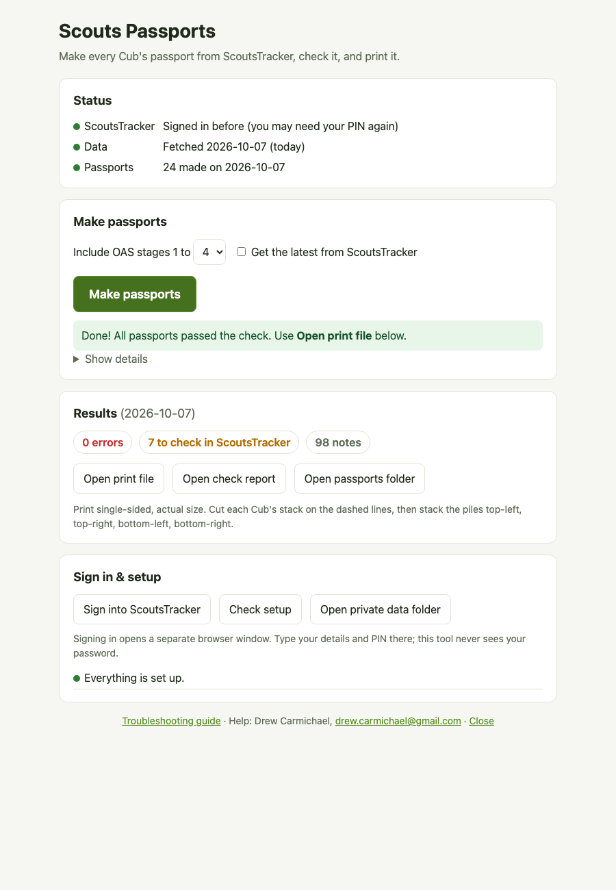

# Scouts Passport

Makes a filled-in **Cub passport** for every Cub in your Pack, straight from ScoutsTracker:
ticks, stage sign-offs (date + Scouter), nights at camp, the OAS overview grid, and
extra pages for **stage 4 and up** in the same style as the printed booklet. Then it
checks every passport and makes a print-ready file.

## Install (once)

**Mac** — open *Terminal* and paste:

```
curl -fsSL https://raw.githubusercontent.com/digitally-rendered/scouts-tracker-passport/main/install.sh | sh
```

**Windows** — open *PowerShell* and paste:

```
powershell -ExecutionPolicy ByPass -c "irm https://raw.githubusercontent.com/digitally-rendered/scouts-tracker-passport/main/install.ps1 | iex"
```

You don't need anything installed first. The install line:

- downloads the tool from GitHub into a `ScoutsPassport` folder in your home folder
- installs **uv**, which installs and manages Python for this tool only
- installs Python 3.12 and the libraries (PyMuPDF for PDFs, Playwright to read ScoutsTracker)
- downloads a private copy of the Chromium browser, used only to read ScoutsTracker
- puts two shortcuts on your Desktop: **Scouts Passports** (opens the page) and **Check setup**

It takes a few minutes and about 500 MB. Run the same line again any time to update; your data is kept.
Optional: Microsoft Office provides the Aptos font used on the stage 4+ pages (see Troubleshooting).

At the end it opens a browser window: **sign into ScoutsTracker there yourself**
(as you normally would, including your PIN). The tool remembers the login; it never
sees or stores your password.

> Already have the folder (e.g. downloaded the zip from GitHub)? Double-click `setup.command` (Mac)
> or `setup.bat` (Windows) instead. Mac may say the file is from an "unidentified developer":
> right-click it → **Open**. Windows may show "Windows protected your PC": **More info → Run anyway**.

ScoutsTracker asks for your **security PIN** again every so often. When the page says it needs
you to sign in again, click **Sign into ScoutsTracker**, enter your PIN, then **Make passports** again.

## Make passports

Double-click **Scouts Passports** on your Desktop. A page opens in your web browser.



1. **First time, or when it asks for your PIN:** click **Sign into ScoutsTracker**. Sign in
   in the window that opens (email, password, PIN). It closes by itself when you're in.
2. Pick the highest OAS stage to include (normally **4**) and click **Make passports**.
   It gets the latest records from ScoutsTracker, makes every passport, and checks them.
3. When it says **Done**, click **Open print file**. The page also shows how many passports
   need attention; **Open check report** explains them.

Keep the small terminal window that opens with the page; closing it closes the tool.
Click **Close** at the bottom of the page when you're finished.

> Prefer the terminal? `run.command` / `run.bat` does the same without the page.

## Print

On the page, under **Print**, pick a **Layout** and a **Printer** (your default is preselected).
The page tells you whether that printer prints both sides by itself.

| Layout | Paper per Cub* | Page size | Finishing |
|---|---|---|---|
| **4 per sheet: cut and stack** | 16 sheets, one side | ~65% | cut on the dashed lines, stack the piles top-left, top-right, bottom-left, bottom-right, staple |
| **Folded booklet** | 16 sheets, both sides | full size | fold the stack in half, staple on the fold |
| **Full size** | 32 sheets (both sides) or 64 (one side) | full size | staple or bind on the left |

\* for a 64-page passport (stages 1-4).

Always click **Print a test sheet** first. Each Cub prints as its own job, so stacks stay separate.

**Booklets on a printer that prints one side only** (e.g. Brother MFC-9130CW): the page switches to
a two-pass mode, one Cub at a time:

1. **Test: print front**. Put that sheet back in the paper tray printed side up (turn it over like a
   page), then **Test: print back**. Fold it: the cover should be on the outside, the right way up.
   If the back came out upside down, tick **Turn backs upside down**; if a multi-sheet booklet's backs
   come out in the wrong order, tick **Reverse backs**. The page remembers these settings.
2. For each Cub: **1. Print fronts**, reload the stack the same way, **2. Print backs**. The page
   then moves to the next Cub.

> Windows: install the free **SumatraPDF** (`winget install SumatraPDF.SumatraPDF`) for exact-size and
> two-sided printing. Without it, Windows' default PDF app prints and may shrink pages.
> Printing by hand instead? The files are in `print 4-up`, `print booklet` and `print full size`.

## Read the audit

`audit.html` lists every Cub:

- **ERROR** — something is missing from that passport. Don't print it; run again, and if it
  persists, use *Check setup* (or ask Claude: `/passport-doctor`).
- **WARN** — something to fix in ScoutsTracker, e.g. *all requirements ticked but stage not awarded*.
  Fix it in ScoutsTracker and run again.
- **INFO** — expected. E.g. *Scouter blank*: ScoutsTracker doesn't know who signed it (often a
  Beaver-era Scouter), so the date is filled and the name is left for you to sign.

## If something goes wrong

1. Double-click **Scouts Passports - Check setup**. Every problem comes with what to do.
2. See **[docs/TROUBLESHOOTING.md](docs/TROUBLESHOOTING.md)**. It covers install blocks on Mac and
   Windows, PIN and login expiry, PDFs left open, audit errors, fonts, and printing.
3. Still stuck? Contact **Drew Carmichael** at **drew.carmichael@gmail.com**, or
   [open an issue](https://github.com/digitally-rendered/scouts-tracker-passport/issues).
   Include the *Check setup* output, which contains no Cub information. **Never send passports,
   the audit, or anything from `ScoutsPassportData`.**

### With Claude Code

Open this folder in Claude Code and use:

| | |
|---|---|
| `/passport-setup` | install and sign in |
| `/passport-run` | make passports and explain the results |
| `/passport-doctor` | find and fix problems |
| `/passport-audit-explain` | explain the audit in plain language |

## Your data stays private

Everything about the Cubs — downloaded records, passports, the audit — and your saved
ScoutsTracker login live in **`ScoutsPassportData`** in your home folder, *not* in the
tool folder. You can share the tool folder; never share `ScoutsPassportData`.
(To keep it elsewhere, set the `PASSPORT_DATA` environment variable.)

Optional files in `ScoutsPassportData`:

- `scouter_names.json` — names for Scouters ScoutsTracker can't identify, e.g. `{"144726": "Jane Smith"}`.
  The IDs are listed when the tool runs.
- `fonts/` — copy `Aptos.ttf`, `Aptos-Bold.ttf`, `Aptos-Narrow.ttf`, `Aptos-Narrow-Bold.ttf`
  here if Microsoft Office isn't installed (otherwise stage 4+ pages use Helvetica).

## For maintainers

| Command | What it does |
|---|---|
| `uv run python passport.py ui` | the point-and-click page (`ui.py`, local only, secret-key URL) |
| `uv run python passport.py run [--stages 1-4] [--no-fetch]` | fetch → build → fill → audit |
| `uv run python print_passports.py --layout 4up\|booklet\|fullsize [--pass fronts\|backs] [--test-sheet] [--dry-run] [--cub NAME]` | print, one job per Cub; `--list` shows printers and whether they print both sides |
| `uv run --group dev pytest` | tests (synthetic Cubs, no real data); CI runs them on Mac/Windows/Linux |
| `uv run python passport.py login` | sign into ScoutsTracker (saved profile) |
| `uv run python doctor.py [--online] [--json]` | setup checks |
| `uv run python passport.py blank --stages 1-5` | blank extended passport (spares) |
| `./package.sh` | build `dist/scouts-passport.zip` (code only) to host for the installers |

Pipeline: `scrape/fetch.py` reads ScoutsTracker's offline database (IndexedDB) through a
saved, logged-in browser profile → `build_data.py` writes CSVs + requirement text →
`fill_passport.py` (with `template_ext.py` for stage 4+ pages and `print_layout.py` for 4-up
sheets) → `audit_passports.py`. Paths are in `paths.py`.

The installers download `main` from GitHub
(`https://github.com/digitally-rendered/scouts-tracker-passport`). To test a different
build, set `PASSPORT_ZIP_URL` (e.g. to a zip from `./package.sh`) before running the installer.

**Never commit Cub data.** `.gitignore` blocks the usual files, and the private workspace lives
outside the repo (`paths.py`).

## Contact

Drew Carmichael — drew.carmichael@gmail.com ·
[Issues](https://github.com/digitally-rendered/scouts-tracker-passport/issues) · MIT licensed.
